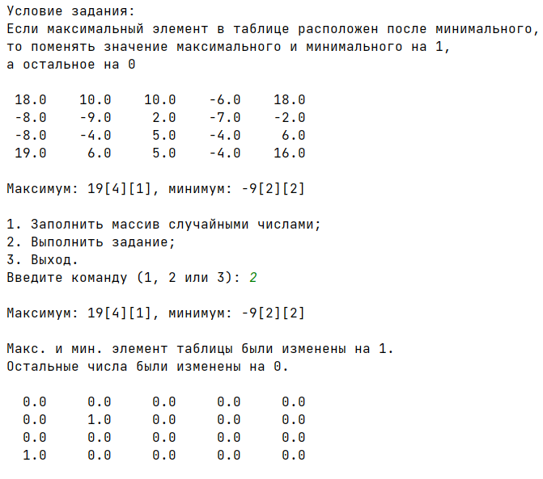

# GMB05_lab03_Python
Practical work 3. In the discipline of Cross-platform Application Development

If the maximum element in the table is located after the minimum, then change the value of the maximum and minimum by 1.


Код реализации алгоритма
```
max_value, min_value, max_i, max_j, min_i, min_j = counting(array)
            for i in range(len(array)):
                for j in range(len(array[i])):
                    k = array[i][j]
                    if k != min_value or k != max_value:
                        array[i][j] = 0
                    if max_i > min_i or max_j > min_j:
                        array[max_i][max_j] = 1
                        array[min_i][min_j] = 1
            print("Макс. и мин. элемент таблицы были изменены на 1.")
            print("Остальные числа были изменены на 0.")
            print_array(array)
```
Teacher: https://github.com/proffix4
